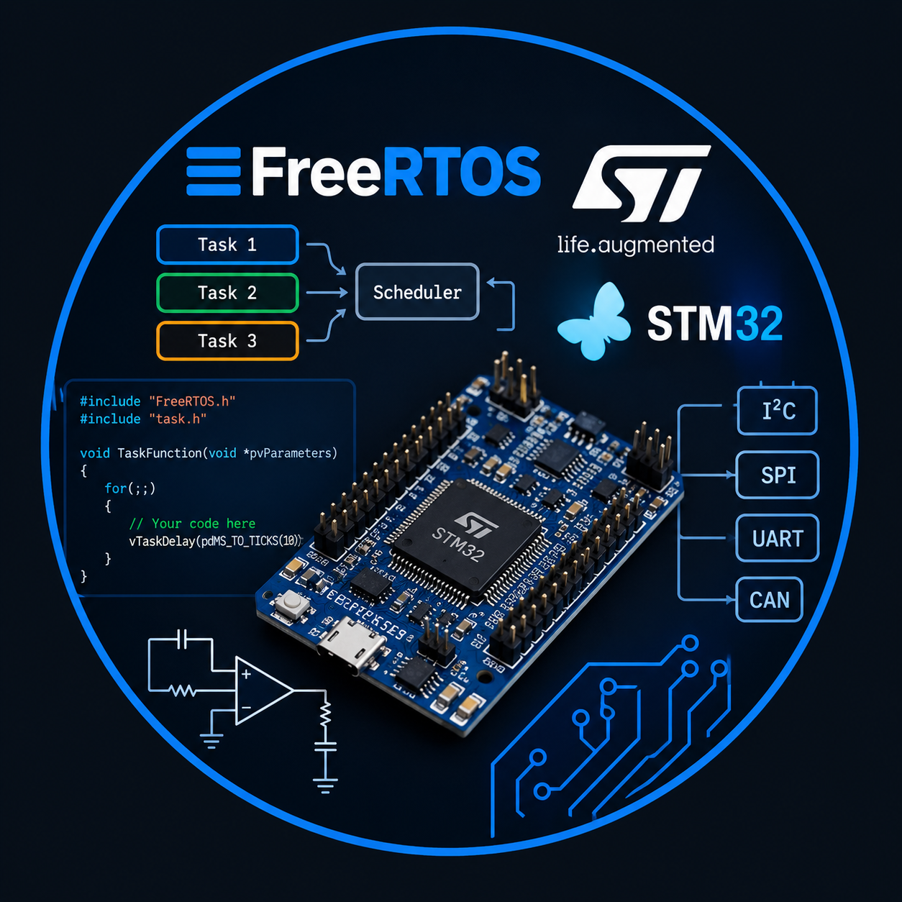

  

# 👋 Hi, I'm Matías Pómpolo

### Electronics Engineer | Embedded Systems Developer | Electronics & PCB Design

I'm an advanced Electronics Engineering student focused on embedded systems,
electronics design and hardware-software integration.

My interests include microcontrollers, real-time systems, PCB design,
communication protocols and Python-based development.

---

## 🚀 About Me

- 🎓 Advanced Electronics Engineering Student
- 🔧 Embedded Systems Development
- 🧠 STM32 / ARM Microcontrollers
- ⚙️ FreeRTOS and Real-Time Systems
- 💻 C / C++ / Python
- 🔌 PCB Design and Electronics
- 📡 CAN, LIN, SPI, I2C and USB
- 📊 Data Analysis and Signal Processing

---

## 🛠️ Technologies & Tools

### Embedded Systems
- STM32
- C / C++
- FreeRTOS
- SPI
- I2C
- CAN
- LIN
- USB
- ADC
- Timers

### Software
- Python
- PyQt5
- SQL-MySQL
- Git / GitHub

### Electronics
- PCB Design
- Altium Designer
- Embedded Hardware
- Electronic Instrumentation
---

## 📫 Contact

- LinkedIn: linkedin.com/in/matias-ezequiel-pómpolo-4ab881168
- Email: matiaspompolo@gmail.com
